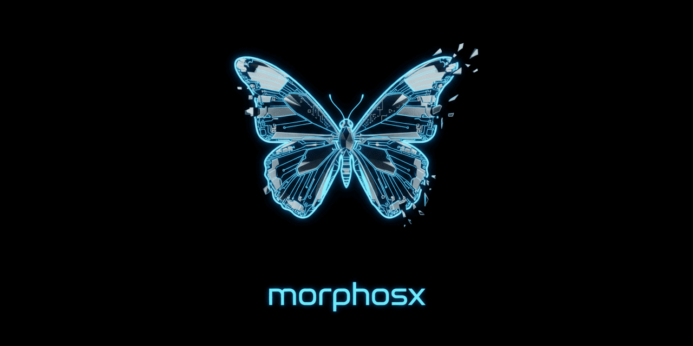

<p align="center">
  
</p>

# morphosx 🧬
> **High performance, low footprint.**  
> Self-hosted, open-source media engine for on-the-fly image processing and delivery.

`morphosx` è un server di elaborazione media ad alte prestazioni progettato per convertire quasi ogni tipo di file in derivati immagine ottimizzati per il web in tempo reale. Gestisce la memorizzazione, la sicurezza tramite firma HMAC e la distribuzione efficiente di asset multimediali.

---

## ⚡ Caratteristiche Principali

### 🖼️ Motore di Immagini Universale
- **Trasformazioni Live**: Ridimensionamento, cambio formato e compressione in memoria.
- **Formati Moderni**: Supporto nativo per **HEIC/HEIF** (iPhone) e **AVIF** (Next-gen).
- **RAW Development**: Sviluppo professionale di file grezzi fotografici (**CR2, NEF, DNG, ARW**) con bilanciamento del bianco della fotocamera.
- **Rendering Vettoriale**: Generazione di anteprime raster da file **SVG**.

### 🎬 Media & Documenti
- **Video Thumbnails**: Estrazione di frame ad alta precisione da **MP4, WEBM, MOV, AVI** specificando il parametro `time`.
- **Audio Waveforms**: Generazione visiva della forma d'onda per **MP3, WAV, OGG, FLAC**.
- **PDF Rendering**: Conversione di pagine specifiche in immagini nitide (parametro `page`).
- **Office Cards**: Generazione di schede riassuntive per **DOCX, PPTX, XLSX** con estrazione dei testi principali.

### 🏗️ Ingegneria & Design
- **BIM Technical Cards**: Estrazione metadati architettonici (muri, piani, finestre) da file **IFC**.
- **3D Blueprints**: Schede tecniche con bounding box e metadati per **STL, OBJ, GLB, GLTF**.
- **Font Specimen**: Generazione di campionari tipografici completi da file **TTF** e **OTF**.
- **Archive Explorer**: Visualizzazione del contenuto di archivi **ZIP** e **TAR** in formato "folder preview".

### 🚀 Performance & Architettura
- **Dual Engine**: Scegli tra **Pillow** (stabilità) o **PyVips** (velocità estrema per grandi file) tramite `MORPHOSX_ENGINE_TYPE`.
- **Storage Modulare**: Supporto per **Local Filesystem** e **Amazon S3** (o compatibili come MinIO/DigitalOcean).
- **Zero-Disk I/O**: Pipeline di elaborazione interamente in RAM tramite buffer `BytesIO`.
- **Intelligent Caching**: I derivati vengono calcolati una volta e serviti istantaneamente dalle richieste successive.

---

## 🛡️ Sicurezza: HMAC-SHA256
MorphosX protegge le tue risorse impedendo la generazione non autorizzata di varianti (che potrebbe causare attacchi DoS). Ogni URL deve essere firmato con un HMAC che include:
`asset_id | width | height | format | quality | preset`

---

## ✨ Smart Presets
Invece di inviare parametri complessi, puoi usare alias predefiniti in `settings.py`:
- `preset=thumb`: 150x150 WebP (Ottimo per avatar/anteprime).
- `preset=hero`: 1920px WebP (Ottimo per banner).
- `preset=social`: 1200x630 JPEG (Ottimo per OpenGraph/Social share).

---

## 🚀 Guida Rapida

### 1. Prerequisiti
- **Python 3.11 - 3.14**
- **FFmpeg** (per video e audio)
- **libvips** (opzionale, per prestazioni ultra-elevate)

### 2. Installazione
```bash
git clone https://github.com/dcdavidev/morphosx.git
cd morphosx
poetry install
```

### 3. Configurazione (.env)
```bash
MORPHOSX_SECRET_KEY="il-tuo-segreto-cyber"
MORPHOSX_STORAGE_TYPE="local" # o "s3"
MORPHOSX_ENGINE_TYPE="pillow" # o "vips"
```

### 4. Avvio
```bash
poetry run start
```

---

## 🧪 Tabella dei Media Supportati

| Categoria | Estensioni | Tipo di Output |
| :--- | :--- | :--- |
| **Immagini** | jpg, png, webp, heic, avif | Immagine Processata |
| **Video** | mp4, mov, webm, avi | Frame @ timestamp |
| **Audio** | mp3, wav, ogg, flac | Waveform Image |
| **Documenti** | pdf, docx, pptx, xlsx | Render Pagina / Summary |
| **BIM** | ifc | Technical Project Card |
| **3D / CAD** | stl, obj, glb, gltf | Technical Blueprint |
| **Testo / Codice**| json, xml, md, txt | Syntax-highlighted Image |
| **Tipografia** | ttf, otf | Font Specimen Image |
| **Archivi** | zip, tar | Content List Image |

---

## 📁 Struttura del Progetto
```text
morphosx/
├── app/
│   ├── api/        # Endpoint FastAPI
│   ├── core/       # Sicurezza & Firma HMAC
│   ├── engine/     # Motori specializzati (Video, 3D, BIM, ecc.)
│   ├── storage/    # Adapter Local e S3
│   └── settings.py # Configurazione centralizzata
└── data/           # Asset originali e Cache dei derivati
```

## 📜 Licenza
MIT - Creato per la comunità Open Source.
